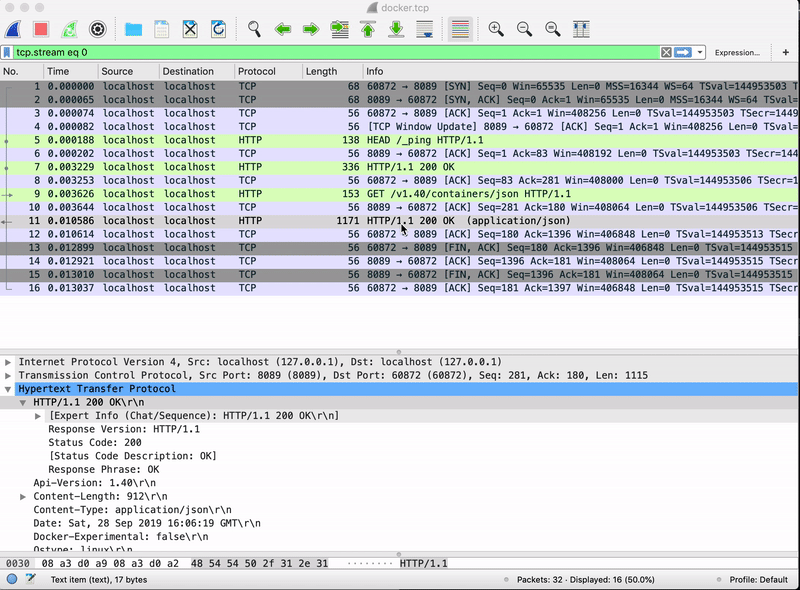

# Use WireShark Analyse Docker API

In this tutorial, we are going to using WireShark to analyse our docker APIs. This will be a very powerful way to inspect our docker API traffic. Will help us understanding more about docker API details.

## Prepare

In order to inspect the network traffic of docker API usage. We are going to use some powerful tools to achieve it.

- `socat`: Use to proxy socket to tcp
- `tcpdump`: Dump tcp traffic detail and generate a file for WireShark to use.
- `WireShark`: A GUI tool to show tcp traffic detail

## Install

I'm using MacOS to demonstrate this. So If you are using MacOS, use `brew` to install our tools:

```bash
brew install socat tcpdump
```

If you are using other linux distribute, make sure you install `socat` and `tcpdump` with your system package manager like `apt`,`yum`,`apk` etc.

## 1. Rename `/var/run/docker.sock`

Using the privilage user to rename `/var/run/docker.sock` to `/var/run/docker.sock.original`.

```bash
sudo mv /var/run/docker.sock /var/run/docker.sock.original
```

By doing this, we just rename the original socket file. The docker daemon will still use that socket file to transport data.

## 2. Proxy TCP To Original Socket

Using `socat` to take anything from TCP port `8089` and apply it to the original socket `docker.sock.original`, with it none the wiser.

```bash
sudo socat TCP-LISTEN:8089,reuseaddr,fork UNIX-CONNECT:/var/run/docker.sock.original
```

## 3. Proxy New Socket To TCP

Using `socat` to take anything from new socket `docker.sock` and apply it to the TCP port `8089`, with it none the wiser.

```bash
sudo socat UNIX-LISTEN:/var/run/docker.sock,fork TCP-CONNECT:127.0.0.1:8089
```

By doing this, a new socket file `/var/run/docker.sock` will be created. Note that this is a new socket file created by `socat`, just using the same name as is.

## 4. Use `tcpdump` To Save Network Traffic As File

Now we have create a proxy to hijack the network traffic sending/receiving from `docker.socket`

```
client -> docker.socket -> TCP:8089 -> docker.socket.original -> docker daemon
```

Any network traffic passing through `docker.sock` will be captured on `TCP:8090`

Find a proper directory to save the TCP traffic by running the following command.

```bash
tcpdump -i lo0 -netvv port 8089 -w docker-traffic.dump
```

Do note that we are dumping traffic from `lo0` network device. This is because on MacOS, `lo0` is the default loop back network device. For other linux system, use your own loop back network device.

## 5. Use WireShark GUI Tool To Analyse

Now open the `WireShark` GUI tool. Go to `File --> Open` menu to open the dumped file `docker-traffic.dump`.

Have Fun!



